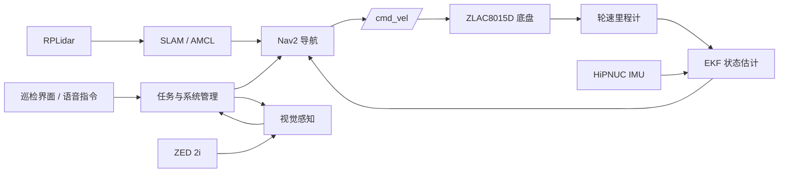

<div align="center">

# 电力巡检机器人

面向电力设施巡检场景的 ROS 2 移动机器人系统

<p>
  
  
  
  
  
  
</p>

集成底盘控制、激光雷达、IMU、建图定位、自主导航、双目视觉、TensorRT 感知、
语音交互和巡检控制界面，提供从硬件接入到上层任务编排的一体化开发工作空间。

[快速开始](#快速开始) · [系统架构](#系统架构) · [功能模块](#功能模块) · [项目文档](#项目文档)

</div>

---

## 核心能力

| 能力 | 实现 |
|---|---|
| 移动底盘 | ZLAC8015D V4 双轮差速底盘，PEAK PCAN-USB、SocketCAN、CANopen |
| 传感器接入 | RPLidar、HiPNUC IMU、ZED 2i，提供稳定设备别名和统一坐标系 |
| 状态估计 | 轮速里程计与 IMU 经 `robot_localization` EKF 融合 |
| 建图定位 | SLAM Toolbox 在线建图，AMCL 定位与 Scan-to-Map 重定位 |
| 自主导航 | Nav2 全局规划、DWB 局部控制、动态障碍处理与低速恢复 |
| 视觉感知 | ZED 深度图像、YOLO、TensorRT 推理和目标空间定位入口 |
| 巡检交互 | 中文控制界面、任务事件、系统状态管理、ASR/TTS 和语音指令 |
| 调试运维 | Jetson 安装/构建/启动脚本、CAN 诊断、ROS 2 回归测试 |

## 系统架构



核心 TF 链：

```text
map -> odom -> base_footprint -> base_link -> laser_link
                         `-----> imu_link
```

## 功能模块

| ROS 2 包 | 职责 |
|---|---|
| `ylhb_base` | CAN/串口底盘、URDF、机器人状态发布、EKF、SLAM、AMCL、Nav2 |
| `ylhb_perception` | ZED 图像输入、YOLO/TensorRT 推理、深度目标定位 |
| `ylhb_llm` | 巡检任务解析、语音输入输出、任务状态、系统管理和显示界面 |
| `ylhb_mobile_bridge` | HTTP/WebSocket 控制与状态桥接 |
| `ylhb_interfaces` | 巡检任务、状态、语音等自定义消息 |
| `hipnuc_imu` | HiPNUC IMU 串口驱动 |
| `rplidar_ros-ros2` | Slamtec RPLidar ROS 2 驱动 |

## 快速开始

### 1. 获取工作空间

推荐将仓库放在 `~/ros2_DL`：

```bash
cd ~
git clone https://github.com/liaojingwu20041031/electric-power-inspection-robot.git ros2_DL
cd ~/ros2_DL
```

运行环境为 Ubuntu 22.04 与 ROS 2 Humble。Jetson 首次部署可执行：

```bash
./scripts/install_jetson_dependencies.sh
./scripts/build_on_jetson.sh
```

常规增量构建：

```bash
source /opt/ros/humble/setup.bash
colcon build --symlink-install
source install/setup.bash
```

### 2. 准备底盘 CAN

ZLAC 底盘默认使用 `can1`，波特率为 `500000`：

```bash
./scripts/setup_zlac_can.sh can1 500000
ip -details link show can1
```

设备连接和权限配置请参考 [重点使用与调试文档](src/PROJECT_DOC_zh.md)。

### 3. 启动机器人

以下模式应根据任务在独立终端中启动：

```bash
# 底盘、IMU、雷达、robot_state_publisher 与 EKF
./scripts/run_on_jetson.sh bringup

# 在线建图
./scripts/run_on_jetson.sh mapping

# 使用 maps/my_map.yaml 定位与导航
./scripts/run_on_jetson.sh navigation

# ZED 2i 与 TensorRT 感知
./scripts/run_on_jetson.sh zed
./scripts/run_on_jetson.sh perception

# 巡检界面、任务管理与语音交互
./scripts/run_on_jetson.sh inspection
```

准备好 `maps/route_patrol_*.json` 后，本地 Nav2 巡逻执行器可用以下入口启动：

```bash
ros2 launch ylhb_mobile_bridge patrol_executor.launch.py \
  auto_start:=false \
  publish_initial_pose_on_startup:=true
```

`auto_start:=false` 表示只加载路线并发布初始位姿，随后停在 `idle` 等待人工确认。
定位稳定、现场安全后，再发送开始命令：

```bash
ros2 topic pub --once /patrol/command std_msgs/msg/String "{data: start}"
```

路线格式、状态观察、暂停/恢复/取消和验收步骤见
[重点使用与调试文档](src/PROJECT_DOC_zh.md#12-本地巡逻-patrol-调试)。

键盘遥控：

```bash
./scripts/run_on_jetson.sh teleop
```

## 导航与机器人模型

- `base_footprint` 保持在差速运动学中心，作为导航与里程计基准。
- URDF 使用与实车外廓一致的偏心圆柱 visual/collision 模型。
- local/global costmap 使用同一组 16 点多边形 footprint。
- 全局地图结合静态层、激光障碍层和膨胀层；局部地图持续处理动态障碍。
- 导航失败时采用受约束的小幅后退和局部代价地图清理，不执行激进恢复动作。

## 构建与验证

针对底盘、几何模型、SLAM、导航配置和重定位逻辑的测试均注册在
`ylhb_base` 包中：

```bash
source /opt/ros/humble/setup.bash
colcon build --symlink-install --packages-select ylhb_base
source install/setup.bash
colcon test --packages-select ylhb_base --event-handlers console_direct+
colcon test-result --verbose
```

硬件诊断入口：

```bash
./scripts/diagnose_pcan.sh
ros2 topic list -t
ros2 topic hz /scan
ros2 topic hz /imu/data
ros2 topic hz /odom
```

## 项目文档

- [重点使用与调试文档](src/PROJECT_DOC_zh.md)：硬件接线、启动流程、ROS 话题和故障排查
- [快速使用](docs/快速使用.md)：开发环境与常用启动命令
- [项目概览](docs/项目概览.md)：软件包和系统边界
- [接口约定](docs/接口约定.md)：巡检任务与语音消息接口
- [电机官方通信协议](官方通信协议/)：ZLAC8015D V4 手册与 CANopen 示例
- [CAD 机械模型](CAD/Retail-Cart-3D-Model/)：底盘、支架和结构件模型

## 使用说明

本仓库用于机器人研发、联调与实验验证。启动底盘前应架空驱动轮或确保周围无人员和障碍物；
修改轮径、轮距、CAN 映射、URDF 或 Nav2 footprint 后，应重新执行包测试并进行低速实车验证。
