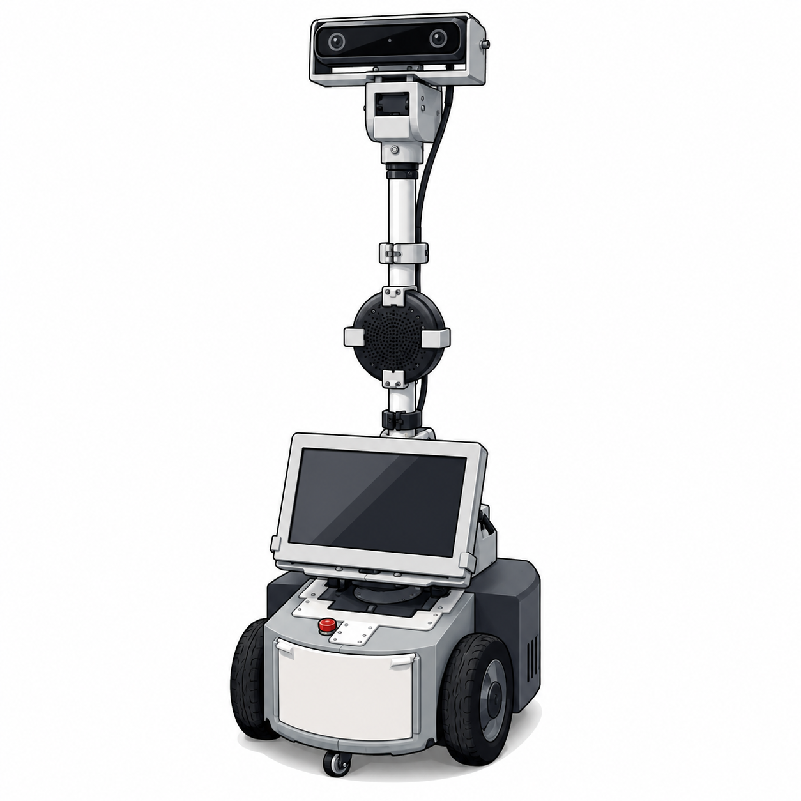
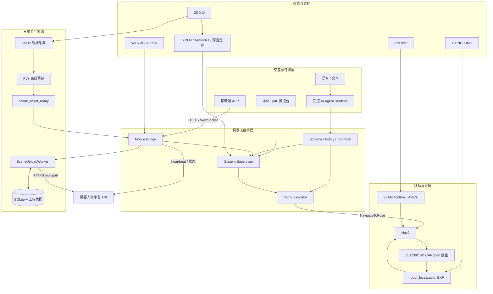
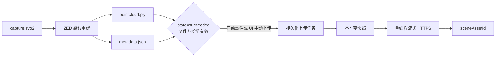

<div align="center">



<sub><b>ELECTRIC POWER INSPECTION ROBOT</b></sub>

# 电力巡检机器人 ROS 2 一体化平台

### 自主巡逻 · 视觉感知 · 三维建模 · AI 任务 · 云端协同

面向电力设施巡检的 Jetson 实机工作空间，将硬件驱动、SLAM/Nav2、路线巡逻、ZED 3D、TensorRT、AI Agent、本体 QML 操控台与 Mobile Bridge 连接成一套可部署、可调试、可扩展的机器人系统。

<p>
  
  
  
  
  
  
  
  
</p>

[项目亮点](#项目亮点) · [系统架构](#系统架构) · [3D 建模与平台上传](#3d-建模与平台上传) · [快速开始](#快速开始) · [开发者导航](#开发者导航) · [完整中文手册](src/电力巡检机器人使用与调试手册.md)

</div>

---

## 项目亮点

<table>
  <tr>
    <td width="33%" valign="top">
      <h3>🧭 自主巡检闭环</h3>
      <p>SLAM Toolbox 建图、AMCL 定位、Nav2 导航、本地路线巡逻、暂停/继续/取消、循环与返航。</p>
    </td>
    <td width="33%" valign="top">
      <h3>👁️ 视觉与空间感知</h3>
      <p>ZED 2i 图像和深度、YOLO/TensorRT 推理、目标深度定位、SVO 采集与 PLY 点云重建。</p>
    </td>
    <td width="33%" valign="top">
      <h3>☁️ 三维资产可靠上传</h3>
      <p>重建完成自动触发，也可从 QML 手动上传；SQLite、不可变快照、SHA-256、幂等键和弱网重试保证任务可恢复。</p>
    </td>
  </tr>
  <tr>
    <td width="33%" valign="top">
      <h3>🤖 受控 AI Agent</h3>
      <p>AgentSpec、ToolPack、schema 与 policy 双层约束。大模型只做任务级决策，不直接开放底盘速度或 Nav2 goal。</p>
    </td>
    <td width="33%" valign="top">
      <h3>🖥️ 本体友好蓝操控台</h3>
      <p>QML 集成状态、巡逻、控制、建图、3D、语音与平台连接页面，统一触控尺寸、状态颜色和信息层级。</p>
    </td>
    <td width="33%" valign="top">
      <h3>📡 本地与云端协同</h3>
      <p>Mobile Bridge 提供 HTTP/WebSocket 与公网 heartbeat，回传系统健康、地图位姿和 GNSS/RTK 新鲜度信息。</p>
    </td>
  </tr>
</table>

### 已贯通的工程链路

```text
硬件接入 → TF / 里程计 / 传感器 → SLAM / AMCL / Nav2 → 路线巡逻
                                      ↓
ZED 图像 / 深度 → TensorRT 感知 → 检查任务 → 事件与状态回传
                                      ↓
SVO 现场采集 → 离线 PLY 重建 → 本地快照 → HTTPS 上传 → 平台资产 ID
```

## 实机展示

<p align="center">
  
</p>

<p align="center">
  <sub>Jetson Orin Nano Super · ZLAC8015D · PEAK PCAN-USB · RPLidar · HiPNUC IMU · WTRTK980 RTK · ZED 2i</sub>
</p>

<table>
  <tr>
    <td width="50%" align="center">
      
    </td>
    <td width="50%" align="center">
      
    </td>
  </tr>
  <tr>
    <td width="50%" align="center">
      
    </td>
    <td width="50%" align="center">
      
    </td>
  </tr>
</table>

## 系统架构



图中表示功能关系，不要求所有节点同时启动。Agent 只调度受控工具；底盘、导航、巡逻和急停边界仍由机器人本地 ROS 2 链路负责。

核心 TF 链：

```text
map → odom → base_footprint → base_link → laser_link
                              ├────────→ imu_link
                              └────────→ gps_link
```

## 3D 建模与平台上传

三维链路采用“现场轻采集、离线重建、后台上传”，避免实时建模和大文件传输占用导航控制资源。



### 产物与触发方式

```text
runs/3d_capture/capture_<timestamp>/capture.svo2
runs/3d_reconstruct/reconstruct_<timestamp>/pointcloud.ply
runs/3d_reconstruct/reconstruct_<timestamp>/metadata.json
```

- **自动触发：** 重建成功且 PLY、metadata 均存在后，Supervisor 发布 `/inspection_ai/scene_asset_ready`，Mobile Bridge 校验事件并创建上传任务。
- **手动触发：** 在本体 UI 的“三维建模”页面点击“上传到平台”；QML 只提交受控 session ID，不接受任意文件路径。
- **手动重试：** 网络失败或凭据修复后可立即重试；同一任务继续复用原 `Idempotency-Key`。

### 机器人端可靠性

| 能力 | 当前实现 |
|---|---|
| 产物校验 | PLY 扩展名、允许目录、最终文件大小、metadata 状态、SHA-256 与 session 身份 |
| 任务持久化 | `scene_uploads` SQLite 表，WAL、事务状态更新，进程重启后继续处理 |
| 上传快照 | 上传前分块复制到独立目录，原子发布；源模型删除或改名不影响已排队任务 |
| 幂等与去重 | `source_reconstruct_session_id + model_sha256` 去重；HTTP 重试不更换幂等键 |
| 网络传输 | HTTPS 证书校验、1 MB 分块 multipart、独立连接/读取超时，不将整个 PLY 读入内存 |
| 弱网恢复 | 指数退避、0%–20% 随机抖动、`Retry-After`、单线程 Worker |
| 磁盘管理 | 活跃任务快照不清理；成功快照按保留时间、数量和总配额回收 |
| 状态回传 | `PENDING`、`UPLOADING`、`FAILED_RETRYABLE`、`CREDENTIAL_BLOCKED`、`FAILED_FINAL`、`SUCCEEDED` |

成功后 UI 显示平台 `sceneAssetId` 和“已上传，待平台审核”。机器人端不会把上传成功误写成“平台已启用”。本地 SVO/PLY 被删除后，资产索引与 UI 会同步清理，不继续展示失效文件。

> **边界说明：** PLY 使用 `RIGHT_HANDED_Z_UP`、单位 `METER`，当前不保证与 ROS `map` frame 对齐。三维模型不会写入 `maps/my_map.yaml`，不参与 Nav2 二维地图加载，也不会替换当前导航地图。

平台上传依赖以下受保护配置：

```text
YLHB_CLOUD_BASE_URL
YLHB_CLOUD_ROBOT_TOKEN
YLHB_CLOUD_CA_FILE
YLHB_ROBOT_ID
YLHB_SCENE_UPLOAD_ENABLED
YLHB_SCENE_UPLOAD_ALLOWED_ROOT
```

详细流程见 [ZED 3D 双阶段建模流程](docs/三维建图工作流程.md)。平台侧需提供 `POST /robot-api/v1/scene-assets`、机器人 Token 和合法 TLS 证书；Web 审核页面不属于本仓库的硬件端实现。

## 核心模块

| 模块 | 主要职责 |
|---|---|
| `src/ylhb_base` | ZLAC8015D 底盘、URDF/TF、EKF、RTK NMEA、SLAM、AMCL、Nav2 与重定位 |
| `src/ylhb_mobile_bridge` | HTTP/WebSocket、本地巡逻执行器、云 heartbeat、GNSS 状态与 3D 资产上传 Worker |
| `src/ylhb_llm` | AI/语音任务层、Agent Runtime、schema/policy、System Supervisor 与本体 QML UI |
| `src/ylhb_perception` | ZED 图像、YOLO/TensorRT、深度目标定位 |
| `src/ylhb_3d_mapping` | SVO2 采集、PLY 点云重建、metadata、资产索引和点云预览 |
| `src/ylhb_interfaces` | 项目自定义 ROS 2 消息与服务接口 |
| `scripts` | Jetson 安装、构建、启动、CAN、PCAN 和实机诊断入口 |
| `maps` / `runs` | 二维地图与路线；三维采集、重建和运行产物 |

## 快速开始

运行环境：Ubuntu 22.04、ROS 2 Humble、Jetson Orin Nano Super。

```bash
git clone https://github.com/liaojingwu20041031/electric-power-inspection-robot.git ~/ros2_DL
cd ~/ros2_DL
./scripts/install_jetson_dependencies.sh
./scripts/build_on_jetson.sh
```

常规增量构建：

```bash
source /opt/ros/humble/setup.bash
colcon build --symlink-install
source install/setup.bash
```

准备 ZLAC 底盘 CAN：

```bash
./scripts/setup_zlac_can.sh can1 500000
ip -details link show can1
```

### 常用运行入口

> ⚠️ `bringup`、`mapping`、`navigation` 和 `inspection` 可能使机器人进入可执行状态。必须由现场操作员确认急停、驱动轮、周围人员和场地安全后运行。

```bash
# 底盘、IMU、雷达、TF 与 EKF
./scripts/run_on_jetson.sh bringup

# SLAM 在线建图
./scripts/run_on_jetson.sh mapping

# 使用 maps/my_map.yaml 定位与导航
./scripts/run_on_jetson.sh navigation

# ZED 2i 与 TensorRT 感知
./scripts/run_on_jetson.sh zed
./scripts/run_on_jetson.sh perception

# ZED 双阶段 3D 建模
./scripts/run_on_jetson.sh zed_3d_capture duration_sec:=30
./scripts/run_on_jetson.sh zed_3d_reconstruct \
  input:=runs/3d_capture/capture_<timestamp>/capture.svo2

# 本体 UI、任务管理、巡逻与语音交互
./scripts/run_on_jetson.sh inspection
```

Mobile Bridge 默认监听 `0.0.0.0:8000`。局域网调试方式见 [Mobile Bridge APP 调试接口](docs/移动端桥接调试接口.md)，公网部署见 [Jetson 云平台连接运维](docs/云平台连接运维.md)。

## 本体操控台

新版 QML 采用统一的友好蓝视觉体系，覆盖：

- 系统总览、连接状态与关键指标；
- 巡逻路线、启动确认、暂停/继续/取消；
- 底盘控制、建图、三维采集与重建；
- 3D 模型上传状态、失败原因、重试和平台资产 ID；
- 语音/AI、日志、Mobile Bridge 与云连接状态；
- 触控友好的按钮尺寸、颜色语义和急停高优先级展示。

UI 有意作为完整 inspection 栈的生命周期锚点。桌面自启动和 systemd/Supervisor 所有权识别可避免 Mobile Bridge 重复启动，详见 [本体 QML 操控台](docs/本体QML操控台.md)。

## AI Agent 安全边界

UI 和语音请求进入 `InspectionAgentRuntime` 后，由 AgentSpec 描述当前可用能力。LLM 只能产生状态查询、巡逻控制、受控系统命令和基础运动技能等任务级 tool calling。

执行前经过两层约束：

1. `agent_schema.validate_decision()` 校验工具名、参数类型与数值范围；
2. `agent_policy.authorize()` 根据风险等级、急停状态和禁止能力决定是否放行。

Agent 不直接开放 `/cmd_vel`、Nav2 goal、删图或任意路线修改。最终执行仍由 ROS2 ToolPack、Supervisor、Patrol Executor 和本地安全链路负责。

## 开发者导航

| 要修改的能力 | 首先查看 |
|---|---|
| 底盘、TF、定位与 Nav2 | `src/ylhb_base` |
| 路线、移动端、云连接与 3D 上传 | `src/ylhb_mobile_bridge`、`maps/route_patrol_*.json` |
| Agent、语音、Supervisor 与 QML | `src/ylhb_llm` |
| ZED、TensorRT 与三维重建 | `src/ylhb_perception`、`src/ylhb_3d_mapping` |
| 安全、平台协议与现场操作 | [`docs/`](docs/) · [完整中文手册](src/电力巡检机器人使用与调试手册.md) |

### 构建与验证

自研包优先按包验证，避免第三方 ZED wrapper 的上游 lint 或网络 schema 问题干扰：

```bash
source /opt/ros/humble/setup.bash
colcon build --symlink-install --packages-select \
  ylhb_base ylhb_llm ylhb_perception \
  ylhb_mobile_bridge ylhb_interfaces ylhb_3d_mapping
source install/setup.bash
colcon test --packages-select \
  ylhb_base ylhb_llm ylhb_perception \
  ylhb_mobile_bridge ylhb_interfaces ylhb_3d_mapping \
  --event-handlers console_direct+
colcon test-result --verbose
```

实机问题先查看真实日志、Topic、TF 和 lifecycle；Mock/Fake 或静态字符串检查不能作为实机功能通过证明。

## 安全与交付边界

- WTRTK980 RTK 当前发布 `/gps/fix`、`/gps/nmea_sentence` 和 `/gps/rtk_status`，并进入 Mobile Bridge 云状态；它不替代 AMCL，不参与 `map → odom` 或巡逻路线计算。
- PLY 三维模型用于展示、复盘和平台资产，不作为 Nav2 二维地图；没有可靠变换时，不将二维路线坐标直接当作点云坐标。
- 三维上传为低优先级单线程后台任务，不应阻塞 heartbeat、远程命令 ACK、Nav2、巡逻事件和急停链路。
- Mobile Bridge 的局域网接口用于现场调试；生产 Token、CA 和平台地址通过受保护配置注入，不写入 QML、ROS Topic 或日志。
- 路线包含 `hard_keepout` 时由 Supervisor 选择 keepout Profile；修改路线、footprint、轮径、轮距或 CAN 映射后必须进行低速实车复验。
- 平台后端、Web/小程序审核与业务报告由对应服务实现；本仓库负责机器人硬件端、ROS 2、本体 UI 和连接协议接入。

## 文档索引

| 分类 | 文档 |
|---|---|
| 现场操作 | [电力巡检机器人使用与调试手册](src/电力巡检机器人使用与调试手册.md) · [本体 QML 操控台](docs/本体QML操控台.md) |
| 三维与 AI | [三维建图工作流程](docs/三维建图工作流程.md) · [AI Agent 工程日志](docs/AI智能体工程日志.md) |
| 平台连接 | [Robot Platform Protocol v1](docs/protocol/robot-platform-v1.md) · [云平台连接运维](docs/云平台连接运维.md) · [移动端桥接调试接口](docs/移动端桥接调试接口.md) |
| 路线与安全 | [路线 JSON 字段参考](docs/路线JSON字段参考.md) · [二值 Keepout 操作](docs/二值禁行区安全地图操作.md) |
| 系统架构 | [架构图与通信矩阵](docs/architecture/README.md) |
| 硬件资料 | [官方通信协议](官方通信协议/) · [CAD 机械模型](CAD/Retail-Cart-3D-Model/) |

---

<div align="center">

**让感知、导航、巡检与三维资产真正运行在同一台机器人上。**

<sub>本仓库用于机器人研发、联调与实验验证。实机运行必须遵守现场安全边界。</sub>

</div>
