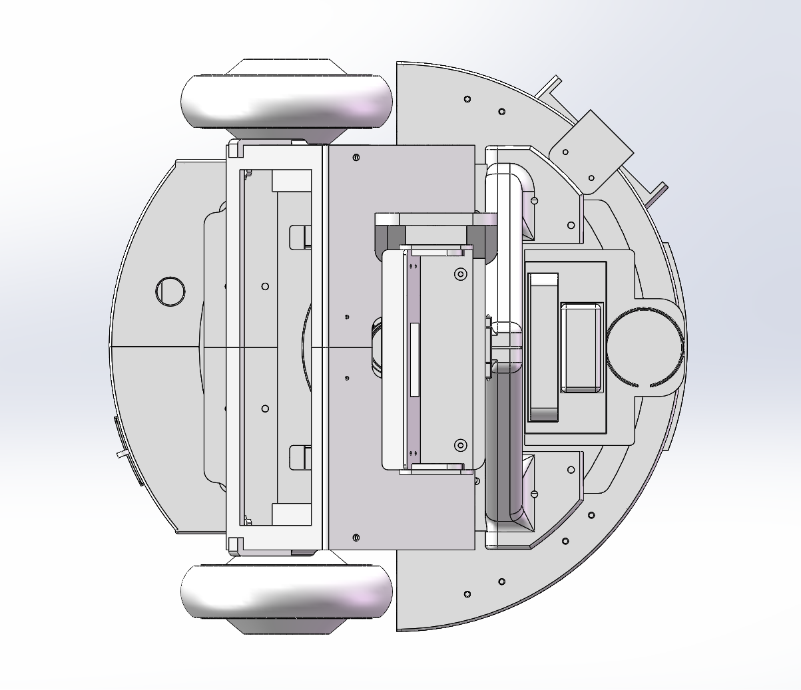
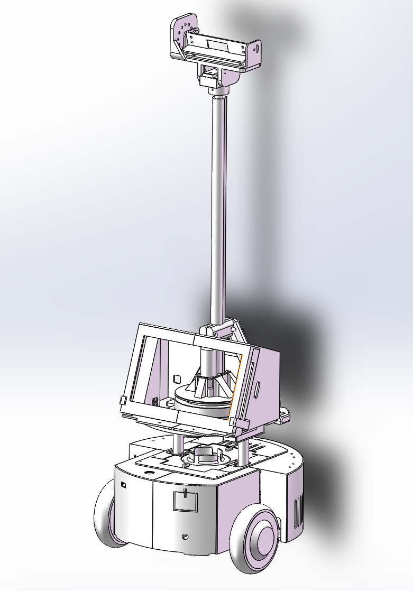
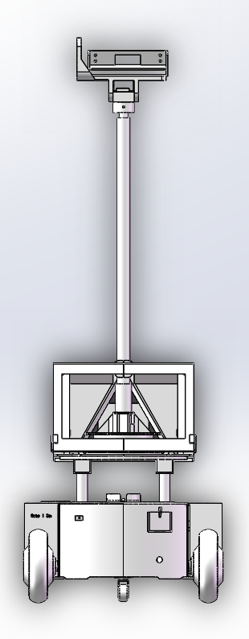
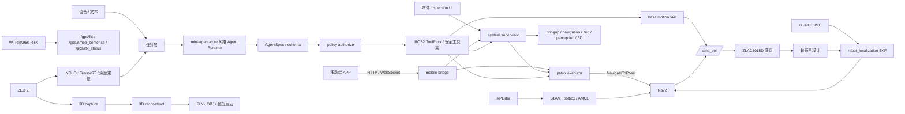

<div align="center">

# 电力巡检机器人 ROS 2 一体化平台

> 面向电力设施巡检的 Jetson + ROS 2 移动机器人：从硬件接入、建图导航到路线巡逻、感知、智能任务与本体操控台的一体化研发工作空间。

<p>
  
  
  
  
  
  
  <a href="https://github.com/liaojingwu20041031/mini-agent-core"></a>
  
</p>


<sub>Jetson Orin Nano Super · ZLAC8015D · RPLidar · HiPNUC IMU · WTRTK980 RTK · ZED 2i</sub>

[查看实机与能力](#能力快照) · [部署到 Jetson](#快速开始) · [扩展与调试](#开发者导航) · [完整中文手册](src/电力巡检机器人使用与调试手册.md)

</div>

---

## 能力快照

| 已具备 | 已验证 / 可复现 | 后续业务接线 |
|---|---|---|
| ROS 2 硬件接入、路线巡逻、ZED/TensorRT、QML 操控台、Mobile Bridge | 构建、地图/路线校验、按现场安全流程执行的实机验收入口 | Spring Bridge、Web/小程序正式业务接线、检查点检测服务、告警与报告 |

| 从这里开始 | 适合谁 | 入口 |
|---|---|---|
| 项目展示 | 答辩、评审、访客 | [实机展示](#实机展示) · [项目亮点](#项目亮点) · [系统架构](#系统架构) |
| Jetson 部署 | 现场部署、台架联调 | [快速开始](#快速开始) · [安全与交付边界](#安全与交付边界) |
| 开发扩展 | ROS 2 开发者、模块维护者 | [开发者导航](#开发者导航) · [完整中文手册](src/电力巡检机器人使用与调试手册.md) · [专项文档](#专项文档) |

## 实机展示

<p align="center">
  
</p>

<table>
  <tr>
    <td width="50%" align="center">
      
    </td>
    <td width="50%" align="center">
      
    </td>
  </tr>
  <tr>
    <td width="50%" align="center">
      
    </td>
    <td width="50%" align="center">
      
    </td>
  </tr>
</table>

## 项目亮点

| 方向 | 已集成能力 |
|---|---|
| 实机硬件集成 | Jetson Orin Nano Super、ZLAC8015D V4、PEAK PCAN-USB、RPLidar、HiPNUC IMU、WTRTK980 RTK 和 ZED 2i 的统一 ROS 2 工作空间 |
| Nav2 巡逻闭环 | SLAM Toolbox 建图、AMCL 定位、Nav2 单点导航、本地路线巡逻、暂停/继续/取消、返航和到点任务触发 |
| ZED 双阶段 3D 建模 | 现场录制 SVO，离线重建 PLY 点云或 OBJ 网格；输出用于巡检展示和复盘，不混入 Nav2 二维地图 |
| TensorRT 感知入口 | ZED 图像与深度、YOLO/TensorRT 推理、目标深度定位和 `/perception/*` 输出链路 |
| AI Agent 任务层 | 自研 `mini-agent-core` 轻量 Agent 思路，使用 AgentSpec、ToolPack、OpenAI-compatible tool calling 和 schema/policy 双层约束；只暴露受控高层工具，不直接开放 `/cmd_vel` 或 Nav2 goal |
| 本体 UI 与移动端联调 | QML 巡逻/三维/状态/语音页面，HTTP/WebSocket mobile bridge，Expo React Native 调试 APP；UI 退出有意关闭完整 inspection 栈，避免后台节点残留 |
| 平台连接基础设施 | Robot/Mobile Bridge 已具备公网 heartbeat、部署配置和协议文档；Spring Bridge 与 Web/小程序正式业务接线仍为后续工作 |

## AI Agent 轻量核心

本项目不是把大模型直接接到底盘或 Nav2，而是在 `ylhb_llm` 内实现了本地化的
mini-agent-core 风格运行时。UI 和语音请求进入 `InspectionAgentRuntime` 后，
运行时根据 `InspectionAgentSpecBuilder` 生成任务能力描述，LLM 只产出任务级
tool calling，例如状态查询、巡逻控制、受控系统命令和基础运动技能。

LLM 决策不会直接落到 ROS 2 控制接口。`agent_schema.validate_decision()` 先校验
工具名、参数类型和数值范围，`agent_policy.authorize()` 再按工具风险等级、急停状态
和禁止能力做二次约束。通过校验后，执行才交给 ROS2 ToolPack、system supervisor、
patrol executor 或 base motion skill。这样 Agent 层负责意图解析和任务编排，底盘、
导航、巡逻、急停等安全边界仍留在机器人本地控制链路中。

## 系统架构



图中是功能数据关系，不表示所有节点必须同时启动。实机启动组合以
[重点使用与调试文档](src/电力巡检机器人使用与调试手册.md) 为准。
Agent 层只做任务级决策，ROS 2 侧执行仍通过受控 ToolPack、巡逻执行器和基础运动技能完成。

核心 TF 链：

```text
map -> odom -> base_footprint -> base_link -> laser_link
                         `-----> imu_link
                         `-----> gps_link
```

## 项目目录

| 类型 | 路径 | 用途 |
|---|---|---|
| 根目录资源 | `scripts/` | Jetson 安装、构建、启动、CAN、PCAN 和实机诊断入口 |
| 根目录资源 | `maps/` | Nav2 地图 `my_map.*` 与本地巡逻路线 `route_patrol_*.json` |
| 根目录资源 | `runs/` | 3D 采集、离线重建、日志和现场运行产物 |
| 根目录资源 | `docs/`、`官方通信协议/`、`CAD/`、`记录照片/` | 调试文档、硬件协议、机械模型和展示素材 |
| ROS 包 | `src/ylhb_base` | 底盘、URDF/TF、EKF、RTK NMEA、SLAM、AMCL、Nav2 和重定位 |
| ROS 包 | `src/ylhb_mobile_bridge` | HTTP/WebSocket 调试桥接、本地 Nav2 巡逻执行器、路线文件校验 |
| ROS 包 | `src/ylhb_llm` | AI/语音任务层、mini-agent-core 风格 Agent Runtime、schema/policy 安全约束、system supervisor、本体 QML UI |
| ROS 包 | `src/ylhb_perception` | ZED 图像、YOLO/TensorRT、深度目标定位 |
| ROS 包 | `src/ylhb_3d_mapping` | ZED SVO 采集、PLY/OBJ 重建和点云预览发布 |
| ROS 包 | `src/ylhb_interfaces`、`src/hipnuc_imu`、`src/rplidar_ros-ros2`、`src/zed-ros2-wrapper` | 自定义消息、IMU 驱动、雷达驱动和 ZED 官方 wrapper |

## 开发者导航

| 要改什么 | 首先查看 | 说明 |
|---|---|---|
| 底盘、TF、定位、Nav2 | `src/ylhb_base` | 底盘后端、URDF、EKF、SLAM、AMCL、导航配置 |
| 路线与外部接口 | `src/ylhb_mobile_bridge`、`maps/route_patrol_*.json` | 本地巡逻执行器、路线校验、HTTP/WebSocket 与 Cloud Link |
| Agent、语音与本体 UI | `src/ylhb_llm` | 任务编排、system supervisor、QML 控制台与 UI 生命周期 |
| 视觉与三维 | `src/ylhb_perception`、`src/ylhb_3d_mapping` | ZED、TensorRT 检测、深度定位、SVO/PLY/OBJ 工作流 |
| 安全、协议与现场手册 | [`docs/`](docs/) · [`src/电力巡检机器人使用与调试手册.md`](src/电力巡检机器人使用与调试手册.md) | 路线安全、平台协议、云连接、硬件与现场操作说明 |

## 快速开始

运行环境为 Ubuntu 22.04、ROS 2 Humble 和 Jetson Orin Nano Super。推荐工作空间路径为 `~/ros2_DL`。

```bash
git clone https://github.com/liaojingwu20041031/electric-power-inspection-robot.git ~/ros2_DL
cd ~/ros2_DL
./scripts/install_jetson_dependencies.sh
./scripts/build_on_jetson.sh
```

常规增量构建：

```bash
source /opt/ros/humble/setup.bash
colcon build --symlink-install
source install/setup.bash
```

准备 ZLAC 底盘 CAN：

```bash
./scripts/setup_zlac_can.sh can1 500000
ip -details link show can1
```

常用运行入口：

> ⚠️ 以下 `bringup`、`navigation`、`inspection` 等入口可能使机器人进入可执行状态。请由现场操作员确认急停、场地和设备状态后执行；不要将静态构建或文档检查视为实机通过。

```bash
# 底盘、IMU、雷达、robot_state_publisher 与 EKF
./scripts/run_on_jetson.sh bringup

# 在线建图
./scripts/run_on_jetson.sh mapping

# 使用 maps/my_map.yaml 定位与导航
./scripts/run_on_jetson.sh navigation

# 本地巡逻执行器
ros2 launch ylhb_mobile_bridge patrol_executor.launch.py \
  auto_start:=false \
  publish_initial_pose_on_startup:=true

# ZED 2i 与 TensorRT 感知
./scripts/run_on_jetson.sh zed
./scripts/run_on_jetson.sh perception

# ZED 双阶段 3D 建模
./scripts/run_on_jetson.sh zed_3d_capture duration_sec:=30
./scripts/run_on_jetson.sh zed_3d_reconstruct input:=runs/3d_capture/capture_<timestamp>/capture.svo2

# 本体巡检 UI、任务管理与语音交互
./scripts/run_on_jetson.sh inspection
```

移动端调试桥接：

```bash
source /opt/ros/humble/setup.bash
source install/setup.bash
ros2 launch ylhb_mobile_bridge mobile_bridge.launch.py
```

服务默认监听 `0.0.0.0:8000`。手机与 Jetson 需在同一可信局域网，APP 地址设为
`http://<Jetson_IP>:8000`，并关闭 `Mock Mode`。接口见
[Mobile Bridge APP 调试接口](docs/移动端桥接调试接口.md)。

## 构建与验证

自研包优先按包验证，避免第三方 ZED wrapper 的上游 lint 或网络 schema 问题干扰：

```bash
source /opt/ros/humble/setup.bash
colcon build --symlink-install --packages-select ylhb_base ylhb_llm ylhb_perception ylhb_mobile_bridge ylhb_interfaces ylhb_3d_mapping
source install/setup.bash
colcon test --packages-select ylhb_base ylhb_llm ylhb_perception ylhb_mobile_bridge ylhb_interfaces ylhb_3d_mapping --event-handlers console_direct+
colcon test-result --verbose
```

硬件诊断入口：

```bash
./scripts/diagnose_pcan.sh
ros2 topic list -t
ros2 topic hz /scan
ros2 topic hz /imu/data
ros2 topic hz /odom
ros2 topic echo /gps/rtk_status --once
```

## 安全与交付边界

- WTRTK980 RTK 当前是第一阶段接入，只发布 `/gps/fix`、`/gps/nmea_sentence` 和 `/gps/rtk_status`；不参与 AMCL、Nav2、`map -> odom` 或巡逻路线计算。
- ZED 3D 输出是 PLY/OBJ/预览点云，用于展示、复盘和后续空间建模；不作为 Nav2 的二维 `map.yaml/pgm`。
- AI Agent 当前用于任务级意图解析、状态查询、受控系统命令和基础运动技能调度；不直接开放 `/cmd_vel`、Nav2 goal、删图、改路线等高风险能力。
- 当前仓库已提供 normal/keepout 自动选择的路线巡逻、二值虚拟墙膨胀、路线安全检查、返航/循环和 UI 状态刷新；正式巡检业务协议、检查点检测服务、告警库和报告导出仍是后续扩展。
- Robot/Mobile Bridge 已具备公网 heartbeat、部署配置和协议合同；Spring Bridge 与 Web/小程序正式业务接线尚未完成。
- mobile bridge 面向现场调试，不替代正式巡检任务系统；应只在可信局域网使用。生产模式以 systemd/Supervisor 所有权解析避免重复实例，详情见 [本体 QML 操控台](docs/本体QML操控台.md)。

## 专项文档

### 现场操作

- [重点使用与调试文档](src/电力巡检机器人使用与调试手册.md)：硬件接线、启动组合、数据流、巡逻、感知、RTK 和故障排查
- [Mobile Bridge APP 调试接口](docs/移动端桥接调试接口.md)：移动端状态、底盘控制、建图、巡逻和安全限制
- [本体 QML 操控台](docs/本体QML操控台.md)：完整 inspection 栈生命周期、Mobile Bridge 所有权、云连接与 kiosk 指引

### 平台连接

- [Robot Platform Protocol v1](docs/protocol/机器人平台协议-v1.md)：公网 heartbeat、命令、事件、deployment、鉴权与恢复合同
- [Jetson 云平台连接运维](docs/云平台连接运维.md)：platform.env、systemd、Cloud UI、日志脱敏、备份和本地回退
- [移动端 APP 仓库](https://github.com/liaojingwu20041031/ylhb-robot-mobile)：Expo React Native 局域网调试端

### 路线与安全

- [路线 JSON 字段参考](docs/路线JSON字段参考.md)：v2/v3 兼容、地图绑定、keepout、循环与 schedule 契约
- [二值 Keepout 操作](docs/二值禁行区安全地图操作.md)：mask 生成/checker、Profile、lifecycle 与现场验收

### 三维与 AI

- [ZED 3D 双阶段建模流程](docs/三维建图工作流程.md)：SVO 采集、离线重建、QML 页面和 RViz 预览
- [AI Agent 工程日志](docs/AI智能体工程日志.md)：mini-agent-core 风格本地运行时、工具策略、话题 schema 和测试入口
- [mini-agent-core](https://github.com/liaojingwu20041031/mini-agent-core)：作者独立维护的轻量 Agent Core / SDK 模板

### 硬件资料

- [官方通信协议](官方通信协议/)：ZLAC8015D V4 手册、CANopen 示例和 RTK 接入资料
- [CAD 机械模型](CAD/Retail-Cart-3D-Model/)：底盘、支架和结构件模型

## 使用说明

本仓库用于机器人研发、联调与实验验证。启动底盘前应架空驱动轮或确保周围无人员和障碍物；
修改轮径、轮距、CAN 映射、URDF 或 Nav2 footprint 后，应重新执行包测试并进行低速实车验证。

## 安全地图、路线工具与 UI 自启动

Keepout 禁行区入口：

带启用 `hard_keepout` 的路线会由 supervisor 自动选择 keepout Profile；普通路线选择 normal Profile。现场推荐从 `./scripts/run_on_jetson.sh inspection` 进入巡逻模式，不再使用旧 `enable_keepout` 或旧 mask 文件命令。

```bash
python3 scripts/generate_keepout_mask.py \
  --map maps/my_map.yaml \
  --route maps/route_patrol_001.json \
  --nav2-params src/ylhb_base/config/nav2_params_keepout.yaml \
  --output-dir maps/keepout
python3 scripts/check_keepout_setup.py \
  --map maps/my_map.yaml \
  --route maps/route_patrol_001.json \
  --nav2-params src/ylhb_base/config/nav2_params_keepout.yaml \
  --output-dir maps/keepout
```

路线安全检查：

```bash
python3 scripts/validate_route_safety.py --map maps/my_map.yaml --route maps/route_patrol_001.json --nav2-params src/ylhb_base/config/nav2_params_keepout.yaml --report
```

PC 标注工具在 `tools/route_map_tool/route_map_tool.html`，禁行区直接保存在 route JSON 的 `keepout_zones`，默认导出 v3 路线。`mask_padding_m` 默认 `0.025m`，只是二值墙栅格化边界补偿；最终避让由 InflationLayer `6.0 / 0.35` 负责。

UI 自启动：

```bash
./scripts/install_ui_autostart.sh
./scripts/uninstall_ui_autostart.sh
```

更多细节见 `docs/二值禁行区安全地图操作.md` 和 `docs/本体QML操控台.md`。

### 操控台运维

参见[显示 UI 生命周期与 kiosk 指引](docs/本体QML操控台.md)和[云连接状态语义](docs/云平台连接运维.md)。UI 有意作为完整 inspection 栈的生命周期锚点；桌面自启动只会重启完整栈。

Mobile Bridge 默认使用 `YLHB_MOBILE_BRIDGE_OWNER=auto`，手工 inspection 与桌面自启动共享 systemd/Supervisor 所有权识别，避免核心服务漏启动或重复启动。
