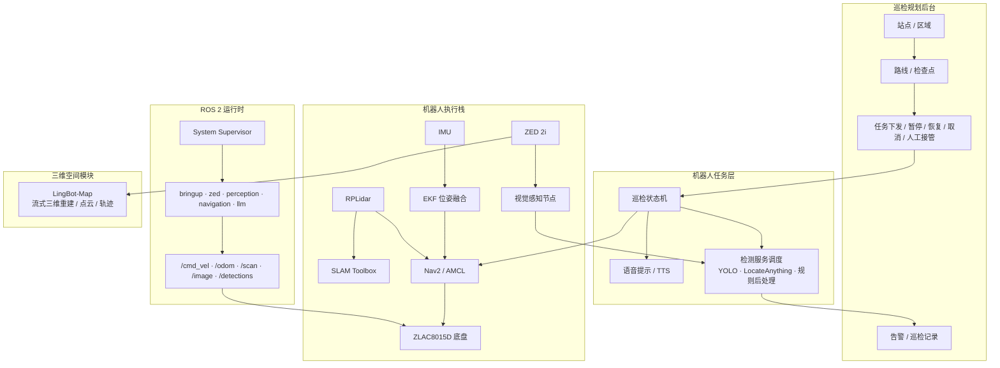

<div align="center">

# 电力行业巡检机器人

### ROS 2 + Jetson Orin Nano Super 驱动的变电站智能巡检机器人

**面向电力实训场景的移动巡检机器人系统，覆盖导航、建图、视觉检测、语音提示、任务执行和后台告警。**

本项目由 `ylhb-smart-retail-robot` 迁移而来，保留原有 ROS 2 底盘、建图、导航、ZED 视觉、语音和 Jetson 本机部署能力，正在逐步把业务层从“智慧零售”改造为“电力行业巡检”。

<p>
  
  
  
  
  
  
  
  
</p>

<p>
  <strong>巡检主线：</strong>
  建图/定位 -> 创建站点区域 -> 规划路线和检查点 -> 下发巡检任务 -> 路线级安全检测 -> 到点采集 -> 检查点级识别 -> 告警与记录
</p>

</div>

---

## 项目目标

本项目目标是把现有移动机器人能力改造成一个电力行业巡检机器人原型：

| 方向 | 目标 |
|---|---|
| 机器人移动 | 基于 ZLAC8015D 底盘、RPLidar、IMU、SLAM Toolbox、Nav2 完成建图、定位、路径规划和避障 |
| 巡检任务 | 支持站点、区域、路线、检查点和检测项配置，机器人按路线执行任务 |
| 路线级感知 | 巡航过程中持续检测人员、未戴安全帽、火源、烟雾、障碍物等风险 |
| 检查点感知 | 到达检查点后调整相机/云台姿态，采集图像或视频，识别开关/刀闸状态、表计/指示灯、漏油、异物、烟火 |
| 语音交互 | 到点播报“已到达指定位置，开始检查”，异常时播报告警或人工接管提示 |
| 后台联动 | 实时展示机器人状态、巡检进度、检测结果、告警和巡检记录 |
| 三维空间 | 预留 LingBot-Map 接入，用于三维重建、空间对齐、点位复用和后台三维可视化 |

---

## 当前迁移状态

| 模块 | 状态 | 说明 |
|---|---|---|
| 底盘控制 | 可复用 | `ylhb_base` 已支持 ZLAC8015D SocketCAN/CANopen、STM32 回退、IMU 和里程计 |
| 建图导航 | 可复用 | `mapping`、`navigation`、`bringup` 启动模式继续可用 |
| ZED / 感知框架 | 可复用 | `ylhb_perception` 可作为巡检检测服务入口，后续替换/扩展检测模型 |
| 语音/TTS | 可复用 | 语音输入、到点播报、异常播报链路继续保留 |
| 总控 UI | 迁移中 | 标题和项目身份已切换为电力巡检；任务按钮和业务逻辑仍需重构 |
| 业务状态机 | 待重构 | 旧的商品推荐/购物车/结算逻辑需要替换为巡检任务/检查点/告警/记录 |
| 模型方案 | 设计中 | 计划引入 LocateAnything-3B 做通用目标定位，同时保留 YOLO/TensorRT 做轻量实时检测 |
| 三维建图 | 设计中 | 计划以 LingBot-Map 作为离线或后台三维重建能力，不直接阻塞机器人实时闭环 |

> 重要说明：ROS 包名和部分话题暂时仍保留 `ylhb_*`、`/retail_ai/*`，这是为了避免第一阶段重命名破坏构建和启动链路。后续会按模块逐步迁移为 `inspection_*` 或 `/inspection/*`。

---

## 核心功能规划

### 前端巡检规划

计划提供以下后台能力：

| 功能 | 说明 |
|---|---|
| 站点管理 | 创建变电站、厂区或实训场地 |
| 区域管理 | 在站点下划分主变区、开关柜区、刀闸区、通道区等 |
| 路线管理 | 在二维/三维地图上绘制巡检路线 |
| 检查点管理 | 为每个检查点绑定位置、朝向、相机/云台姿态和检测项 |
| 检测项配置 | 人员、安全帽、设备开关/刀闸状态、漏油、火源、烟雾、异物、表计/指示灯 |
| 任务控制 | 下发、暂停、恢复、取消、人工接管、异常确认 |

### 机器人执行流程

```text
1. 前端建模并规划巡检路线
2. 后台下发巡检任务到机器人
3. 机器人启动导航，沿路线移动
4. 路线中持续检测人员、未戴安全帽、障碍物、火源和烟雾
5. 到达检查点后语音提示：已到达指定位置，开始检查
6. 调整相机/云台姿态并采集图像或视频
7. 调用检测服务识别开关状态、漏油、火源、异物、表计/指示灯等
8. 后台实时显示告警、检查结果和机器人状态
9. 任务结束后生成巡检记录
```

### 检测设计

| 类型 | 检测对象 | 推荐实现 |
|---|---|---|
| 路线级检测 | 人员、未戴安全帽、火源、烟雾、障碍物 | YOLO/TensorRT 实时检测优先，必要时叠加 LocateAnything |
| 检查点级检测 | 开关状态、刀闸状态、表计/指示灯、漏油、异物、烟火 | LocateAnything 自然语言提示 + 专项分类/规则后处理 |
| 空间定位 | 检测框、深度、机器人位姿、检查点坐标 | ZED 深度 + TF + Nav2 位姿 |
| 三维复用 | 巡检点位对齐、视频复用、三维展示 | LingBot-Map 后台/离线处理 |

---

## 系统架构



---

## 目录结构

```text
.
├── scripts/
│   ├── install_jetson_dependencies.sh   # Jetson 依赖安装
│   ├── build_on_jetson.sh               # 本机构建入口
│   ├── setup_zlac_can.sh                # ZLAC8015D SocketCAN 配置
│   └── run_on_jetson.sh                 # 现场运行入口
├── CAD/
│   └── Retail-Cart-3D-Model/            # 旧结构 CAD，后续作为巡检车结构改造基础
├── docs/
│   ├── electric_power_inspection_plan.md # 电力巡检迁移计划
│   ├── mobile_app_bridge_api.md
│   └── pcan_peak_setup.md
├── maps/
│   ├── my_map.yaml
│   └── my_map.pgm
├── src/
│   ├── ylhb_base/                       # 底盘、IMU、URDF、EKF、SLAM、Nav2
│   ├── ylhb_perception/                 # ZED、YOLO/TensorRT、深度定位、检测服务入口
│   ├── ylhb_llm/                        # 任务层、语音、TTS、UI，业务迁移中
│   ├── ylhb_interfaces/                 # 自定义 ROS 2 消息，业务接口迁移中
│   ├── rplidar_ros-ros2/                # RPLidar ROS 2 驱动源码
│   ├── zed-ros2-wrapper/                # ZED ROS 2 wrapper 源码
│   └── PROJECT_DOC_zh.md                # 详细开发文档，含旧零售逻辑说明和迁移提示
├── MIGRATION_JETSON.md
├── SECURITY.md
└── README.md
```

---

## 快速开始

默认工作区路径仍建议使用 `~/ros2_ws`，这样现有启动脚本不需要大改。

```bash
cd ~
git clone https://github.com/liaojingwu20041031/electric-power-inspection-robot.git ros2_ws
cd ~/ros2_ws
./scripts/install_jetson_dependencies.sh
./scripts/build_on_jetson.sh
```

首次连接 ZLAC8015D 前配置 CAN：

```bash
./scripts/setup_zlac_can.sh can1 500000
ip -br link show can1
```

常用启动模式：

```text
bringup       启动底盘、IMU、雷达、URDF、EKF
mapping       启动 SLAM Toolbox 建图
navigation    启动 Nav2 定位和导航
zed           启动 ZED 2i wrapper
perception    启动视觉感知节点
llm           启动任务层、语音和 UI 相关节点
competition   启动总控 UI、system supervisor 和内嵌任务层
teleop        启动键盘遥控
```

现场入口暂时沿用原脚本：

```bash
./scripts/run_on_jetson.sh competition
```

---

## 机器人部分优先级

第一阶段先完成机器人端可演示闭环：

| 优先级 | 任务 |
|---|---|
| P0 | 保证底盘、雷达、IMU、ZED、Nav2 能稳定启动 |
| P0 | 将 UI 标题、项目说明、任务文案切换到电力巡检 |
| P1 | 新增巡检检查点数据结构和任务状态机 |
| P1 | 到点语音提示和检查点图像采集 |
| P1 | 路线级实时检测：人员、安全帽、障碍物、火源/烟雾 |
| P2 | 检查点级检测：开关/刀闸、表计/指示灯、漏油、异物 |
| P2 | 告警 JSON 和巡检记录 JSON |
| P3 | LingBot-Map 三维重建和后台三维展示 |

---

## 模型接入建议

LocateAnything-3B 适合做检查点级复杂目标定位，例如：

```text
找到图中处于分闸状态的刀闸
定位存在漏油痕迹的区域
找到冒烟或火焰的位置
找到未佩戴安全帽的人员
找到仪表盘中的指针和读数区域
```

但路线级实时避障和安全检测建议保留轻量模型，优先使用 YOLO/TensorRT，避免 3B 模型拖慢机器人运动闭环。LocateAnything 更适合在到点后对关键帧做高价值识别。

LingBot-Map 建议作为后台或离线三维重建模块：

```text
巡检视频 -> 三维重建 -> 相机轨迹/点云 -> 巡检点位对齐 -> 后台三维展示
```

---

## 安全与规范

- 不提交 `DASHSCOPE_API_KEY`、`.env`、SSH key、证书或其他本机密钥。
- 不提交 `.onnx`、`.engine`、`.pt` 等模型二进制文件。
- 串口权限优先使用 udev 规则或用户组。
- 电力巡检演示涉及“火源、烟雾、漏油、设备状态”等安全告警，实训系统只作为辅助识别原型，不替代真实电力安全规程。

---

## 参考

- [LocateAnything-3B](https://huggingface.co/nvidia/LocateAnything-3B)
- [LingBot-Map](https://github.com/robbyant/lingbot-map)
- [详细开发文档](src/PROJECT_DOC_zh.md)
- [Jetson 迁移说明](MIGRATION_JETSON.md)

<div align="center">

**电力行业巡检机器人 — 从“能跑的移动机器人”迁移到“能巡、能看、能告警”的行业应用原型。**

</div>
