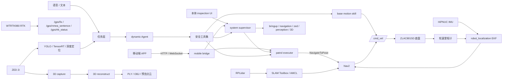

<div align="center">

# 电力巡检机器人 ROS 2 一体化平台

面向电力设施巡检的 Jetson + ROS 2 移动机器人工作空间

<p>
  
  
  
  
  
  
  
</p>

集成 ZLAC 差速底盘、RPLidar、HiPNUC IMU、WTRTK980 RTK、ZED 2i、Nav2、TensorRT 感知、
AI/语音任务层、本体 QML UI 和移动端调试桥接，覆盖从硬件接入、建图导航到巡逻任务编排的完整研发链路。

[实机展示](#实机展示) · [项目亮点](#项目亮点) · [系统架构](#系统架构) · [项目目录](#项目目录) · [快速开始](#快速开始) · [当前边界](#当前边界) · [项目文档](#项目文档)

</div>

---

## 实机展示

<p align="center">
  
</p>

<table>
  <tr>
    <td width="50%" align="center">
      
    </td>
    <td width="50%" align="center">
      
    </td>
  </tr>
  <tr>
    <td width="50%" align="center">
      
    </td>
    <td width="50%" align="center">
      
    </td>
  </tr>
</table>

## 项目亮点

| 方向 | 已集成能力 |
|---|---|
| 实机硬件集成 | Jetson Orin Nano Super、ZLAC8015D V4、PEAK PCAN-USB、RPLidar、HiPNUC IMU、WTRTK980 RTK 和 ZED 2i 的统一 ROS 2 工作空间 |
| Nav2 巡逻闭环 | SLAM Toolbox 建图、AMCL 定位、Nav2 单点导航、本地路线巡逻、暂停/继续/取消、返航和到点任务触发 |
| ZED 双阶段 3D 建模 | 现场录制 SVO，离线重建 PLY 点云或 OBJ 网格；输出用于巡检展示和复盘，不混入 Nav2 二维地图 |
| TensorRT 感知入口 | ZED 图像与深度、YOLO/TensorRT 推理、目标深度定位和 `/perception/*` 输出链路 |
| 动态 Agent 安全工具链 | Agent 只调用路线、状态、基础运动和系统命令等高层工具，不直接下发 `/cmd_vel` 或 Nav2 goal |
| 本体 UI 与移动端联调 | QML 巡逻/三维/状态/语音页面，HTTP/WebSocket mobile bridge，Expo React Native 调试 APP |

## 系统架构



图中是功能数据关系，不表示所有节点必须同时启动。实机启动组合以
[重点使用与调试文档](src/PROJECT_DOC_zh.md) 为准。

核心 TF 链：

```text
map -> odom -> base_footprint -> base_link -> laser_link
                         `-----> imu_link
                         `-----> gps_link
```

## 项目目录

| 类型 | 路径 | 用途 |
|---|---|---|
| 根目录资源 | `scripts/` | Jetson 安装、构建、启动、CAN、PCAN 和实机诊断入口 |
| 根目录资源 | `maps/` | Nav2 地图 `my_map.*` 与本地巡逻路线 `route_patrol_*.json` |
| 根目录资源 | `runs/` | 3D 采集、离线重建、日志和现场运行产物 |
| 根目录资源 | `docs/`、`官方通信协议/`、`CAD/`、`记录照片/` | 调试文档、硬件协议、机械模型和展示素材 |
| ROS 包 | `src/ylhb_base` | 底盘、URDF/TF、EKF、RTK NMEA、SLAM、AMCL、Nav2 和重定位 |
| ROS 包 | `src/ylhb_mobile_bridge` | HTTP/WebSocket 调试桥接、本地 Nav2 巡逻执行器、路线文件校验 |
| ROS 包 | `src/ylhb_llm` | AI/语音任务层、system supervisor、本体 QML UI、基础运动技能 |
| ROS 包 | `src/ylhb_perception` | ZED 图像、YOLO/TensorRT、深度目标定位 |
| ROS 包 | `src/ylhb_3d_mapping` | ZED SVO 采集、PLY/OBJ 重建和点云预览发布 |
| ROS 包 | `src/ylhb_interfaces`、`src/hipnuc_imu`、`src/rplidar_ros-ros2`、`src/zed-ros2-wrapper` | 自定义消息、IMU 驱动、雷达驱动和 ZED 官方 wrapper |

## 快速开始

运行环境为 Ubuntu 22.04、ROS 2 Humble 和 Jetson Orin Nano Super。推荐工作空间路径为 `~/ros2_DL`。

```bash
git clone https://github.com/liaojingwu20041031/electric-power-inspection-robot.git ~/ros2_DL
cd ~/ros2_DL
./scripts/install_jetson_dependencies.sh
./scripts/build_on_jetson.sh
```

常规增量构建：

```bash
source /opt/ros/humble/setup.bash
colcon build --symlink-install
source install/setup.bash
```

准备 ZLAC 底盘 CAN：

```bash
./scripts/setup_zlac_can.sh can1 500000
ip -details link show can1
```

常用运行入口：

```bash
# 底盘、IMU、雷达、robot_state_publisher 与 EKF
./scripts/run_on_jetson.sh bringup

# 在线建图
./scripts/run_on_jetson.sh mapping

# 使用 maps/my_map.yaml 定位与导航
./scripts/run_on_jetson.sh navigation

# 本地巡逻执行器
ros2 launch ylhb_mobile_bridge patrol_executor.launch.py \
  auto_start:=false \
  publish_initial_pose_on_startup:=true

# ZED 2i 与 TensorRT 感知
./scripts/run_on_jetson.sh zed
./scripts/run_on_jetson.sh perception

# ZED 双阶段 3D 建模
./scripts/run_on_jetson.sh zed_3d_capture duration_sec:=30
./scripts/run_on_jetson.sh zed_3d_reconstruct input:=runs/3d_capture/capture_<timestamp>/capture.svo2

# 本体巡检 UI、任务管理与语音交互
./scripts/run_on_jetson.sh inspection
```

移动端调试桥接：

```bash
source /opt/ros/humble/setup.bash
source install/setup.bash
ros2 launch ylhb_mobile_bridge mobile_bridge.launch.py
```

服务默认监听 `0.0.0.0:8000`。手机与 Jetson 需在同一可信局域网，APP 地址设为
`http://<Jetson_IP>:8000`，并关闭 `Mock Mode`。接口见
[Mobile Bridge APP 调试接口](docs/mobile_debug_api.md)。

## 构建与验证

自研包优先按包验证，避免第三方 ZED wrapper 的上游 lint 或网络 schema 问题干扰：

```bash
source /opt/ros/humble/setup.bash
colcon build --symlink-install --packages-select ylhb_base ylhb_llm ylhb_perception ylhb_mobile_bridge ylhb_interfaces ylhb_3d_mapping
source install/setup.bash
colcon test --packages-select ylhb_base ylhb_llm ylhb_perception ylhb_mobile_bridge ylhb_interfaces ylhb_3d_mapping --event-handlers console_direct+
colcon test-result --verbose
```

硬件诊断入口：

```bash
./scripts/diagnose_pcan.sh
ros2 topic list -t
ros2 topic hz /scan
ros2 topic hz /imu/data
ros2 topic hz /odom
ros2 topic echo /gps/rtk_status --once
```

## 当前边界

- WTRTK980 RTK 当前是第一阶段接入，只发布 `/gps/fix`、`/gps/nmea_sentence` 和 `/gps/rtk_status`；不参与 AMCL、Nav2、`map -> odom` 或巡逻路线计算。
- ZED 3D 输出是 PLY/OBJ/预览点云，用于展示、复盘和后续空间建模；不作为 Nav2 的二维 `map.yaml/pgm`。
- 当前仓库提供底盘、导航、感知、AI/语音、UI 和移动端调试框架；正式巡检业务协议、检查点检测服务、告警库和报告导出仍是后续扩展。
- mobile bridge 面向现场调试，不替代正式巡检任务系统；应只在可信局域网使用。

## 项目文档

- [重点使用与调试文档](src/PROJECT_DOC_zh.md)：硬件接线、启动组合、数据流、巡逻、感知、RTK 和故障排查
- [Mobile Bridge APP 调试接口](docs/mobile_debug_api.md)：移动端状态、底盘控制、建图、巡逻和安全限制
- [ZED 3D 双阶段建模流程](docs/3d_mapping_workflow.md)：SVO 采集、离线重建、QML 页面和 RViz 预览
- [AI Agent 工程日志](docs/AI_AGENT_ENGINEERING_LOG.md)：动态 Agent、工具策略、话题 schema 和测试入口
- [移动端 APP 仓库](https://github.com/liaojingwu20041031/ylhb-robot-mobile)：Expo React Native 局域网调试端
- [官方通信协议](官方通信协议/)：ZLAC8015D V4 手册、CANopen 示例和 RTK 接入资料
- [CAD 机械模型](CAD/Retail-Cart-3D-Model/)：底盘、支架和结构件模型

## 使用说明

本仓库用于机器人研发、联调与实验验证。启动底盘前应架空驱动轮或确保周围无人员和障碍物；
修改轮径、轮距、CAN 映射、URDF 或 Nav2 footprint 后，应重新执行包测试并进行低速实车验证。
